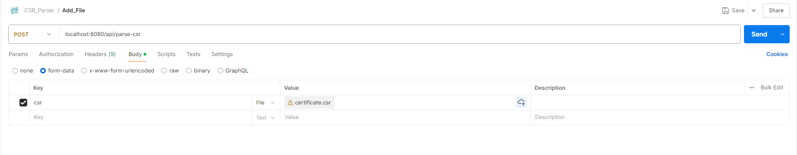

# Certificate_Signing_Request_Parser
In this repository, I am working on processing CSR (Certificate Signing Request) files and displaying their information in a dashboard.  

The implementation uses the following technologies:  
- **Backend:** A Spring Boot application to process CSR files and provide data via APIs.  
- **Frontend:** A JavaScript-based application for visualizing the data in the dashboard.  

The goal is to create a user-friendly and efficient solution for processing and displaying CSR files.  

How to generate the CSR File with help of openssl. 

openssl req -new -newkey rsa:2048 -nodes -keyout private.key -out certificate.csr


Here’s a clearer and more polished version of your explanation:

---

### How to Start the Application

1. Navigate to the following directory:  
   **`..\src\main\resources\result`**

2. Start the application using the following command:
   ```bash
   java -jar csr-parser-0.0.1.jar
   ```

3. If you want to start the application on a different port, use the following command:
   ```bash
   java -jar csr-parser-0.0.1.jar --server.port=9090
   ```

---

### Logs Location

The application writes logs to a file named **`application.log`**, located in the current working directory. This file contains all application logs, including errors and status messages.

---

### Application Endpoint

Once the application has started successfully, the following endpoint will be available:
```
http://localhost:8080/api/parse-csr
```

---

### Sending a CSR File to the Endpoint

To send a CSR (Certificate Signing Request) file to the endpoint, use the following `curl` command:
```bash
curl --location 'http://localhost:8080/api/parse-csr' --form 'csr=@"/path/to/file"'
```
Replace `"/path/to/file"` with the actual path to the CSR file you want to send.

or use postman with the following settings: 
